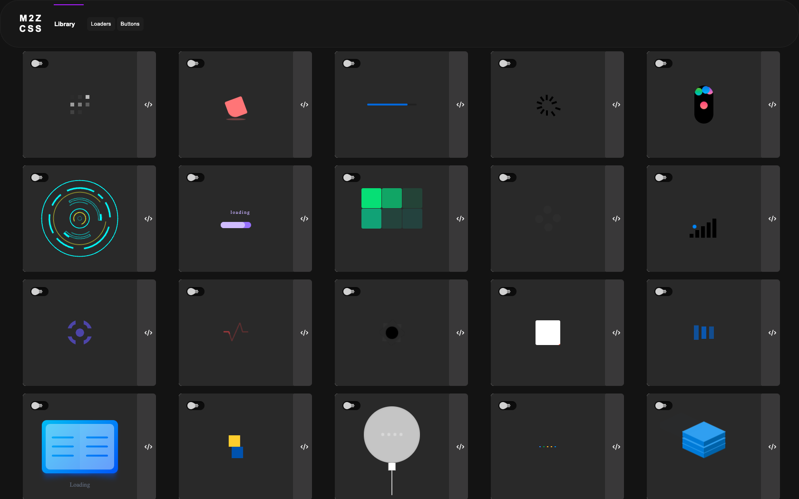

# M2Z CSS Library



## Overview
The M2Z CSS Library is a collection of reusable CSS components and JavaScript functionalities designed to streamline the development of web applications. This library provides a set of styles and scripts that can be easily integrated into your projects to enhance the user interface and experience.

## Project Structure
The project consists of the following files:

- **index.html**: The main HTML document
- **style.css**: Core CSS styles
- **hh.css**: Component-specific styles
- **code.js**: Core JavaScript functionality
- **script.js**: Additional interactivity features


## Installation
```bash
# Clone the repository
git clone https://github.com/yourusername/M2Z-CSS-Library.git

# Navigate to project directory
cd M2Z-CSS-Library
```

## Usage
1. Include CSS files:
   ```html
   <link rel="stylesheet" href="style.css">
   <link rel="stylesheet" href="hh.css">
   ```

2. Include JavaScript files:
   ```html
   <script src="code.js"></script>
   <script src="script.js"></script>
   ```

## Contributing
Contributions welcome! Please read our [Contributing Guidelines](CONTRIBUTING.md).

## License
MIT License - See [LICENSE](LICENSE) for details.